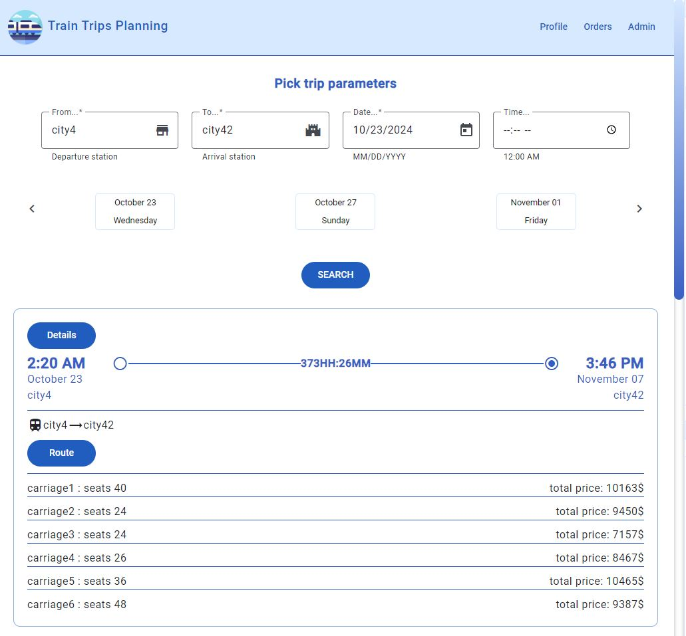
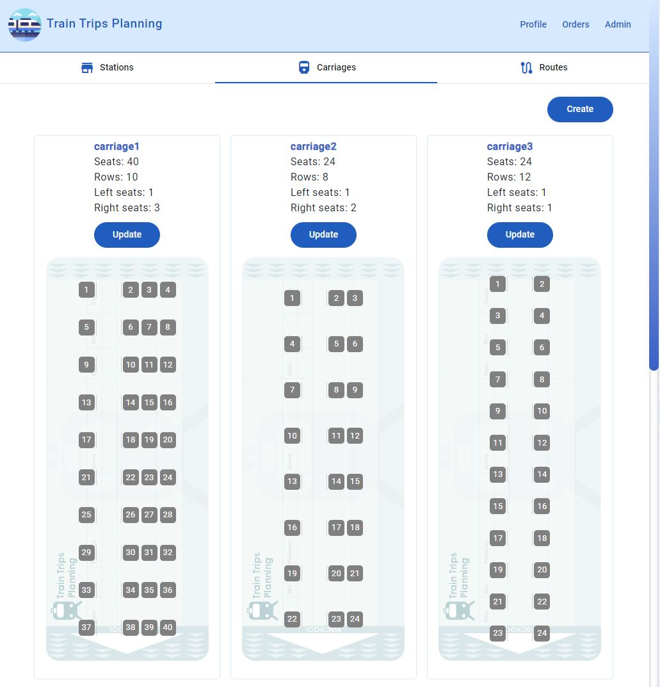

# Train Trips Planning 

This awesome app is the final team [project](https://github.com/rolling-scopes-school/tasks/tree/master/tasks/train-a) of [RSSchool](https://app.rs.school/registry/student) [**Angular**](https://rs.school/) 2024Q3 Course.

Deployment https://train-a-lyutails-projects.vercel.app/

## Development server

To install dependencies run `yarn install`.

Run `ng serve` for a dev server. Navigate to `http://localhost:4200/`. The application will automatically reload if you change any of the source files.

### Manager credentials

The manager and the root administrator can enter the system with 
email: admin@admin.com 
password: my-password 

### Further help

This project was generated with [Angular CLI](https://github.com/angular/angular-cli) version 18.2.0.

To get more help on the Angular CLI use `ng help` or go check out the [Angular CLI Overview and Command Reference](https://angular.dev/tools/cli) page.

