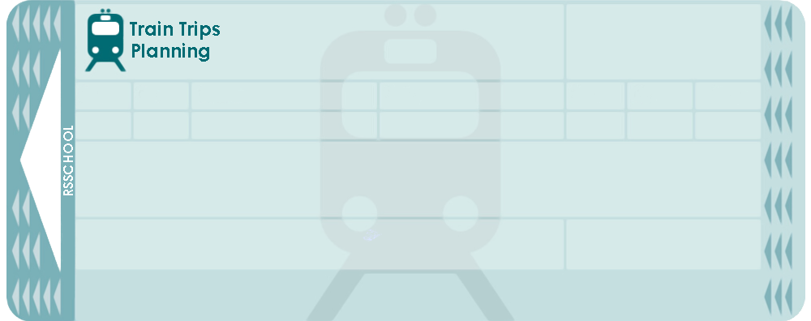

# Styling ideas to use accross the **Trips Train Planning application**. 

## 1. Usage of Angular Material UI in the project:

- blue built-in colour scheme
- appearance `outline` for mat-form-field
- usage of `mat-flat-button`
- usage of nesting in .scss

## 2. Usage of Bootstrap in the project:

- container class `container-xl` for top level wrapper of the component if the content gonna take full screen size
- for top level container for the pages with centered content `d-flex justify-content-center align-items-center vh-100`

## 3. Commits convention:

- commit prefix like fix / feat / refactor / init etc.
- commit scope following commit prefix in paranthesis like this: `'feat(component): create...'`
- commit message start with verb in simple present time
- commit body is short, descriptive and informative
